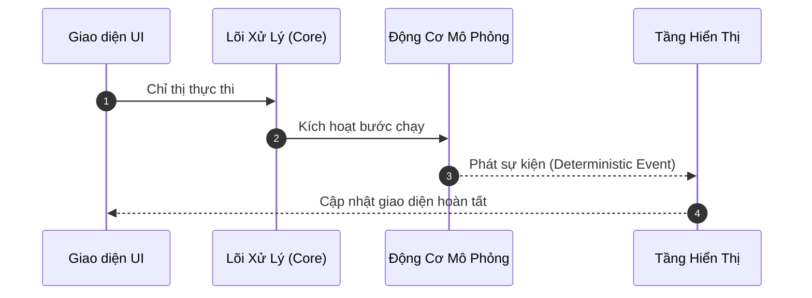

# DATA_FLOW_TEMPLATE.md

> **Mục Đích Tài Liệu**: Mô tả các luồng xử lý và di chuyển dữ liệu tuần tự trong hệ thống: nguồn phát sinh dữ liệu, các bước chuyển đổi, chủ thể sở hữu trạng thái, các sự kiện phát ra, điểm tiếp nhận cuối cùng, cơ chế xử lý lỗi và các bất biến trên đường truyền.  
> **Khi Nào Sử Dụng**: Khi thiết kế các quy trình xử lý đa bước phức tạp hoặc luồng giao tiếp giữa nhiều tầng kiến trúc.  
> **Mục Bắt Buộc**: Tên luồng, Điểm khởi đầu (Source), Các bước xử lý tuần tự, Sự kiện phát sinh, Điểm đến (Destination), Xử lý lỗi, Bất biến của luồng.  
> **Mục Tùy Chọn**: Sơ đồ Mermaid sequence diagram, Biến thể luồng (Alternative paths).  
> **Quy Tắc Dẫn Chiếu**: Dẫn chiếu sang `ARCHITECTURE.md` và `interfaces/API_CONTRACTS.md`. Không định nghĩa lại các kiểu dữ liệu đã có.  
> **Ghi Nhận Thông Tin Chưa Xác Nhận**: Đánh dấu rõ các bước `[CONFIRMED]` và `[PROPOSED]`.

---

# Luồng Dữ Liệu & Chuỗi Sự Kiện (Data Flows & Event Sequences)

```yaml
DOCUMENT_TYPE: DATA_FLOWS
STATUS: [CONFIRMED | PROPOSED | OPEN_QUESTION]
LAST_UPDATED: YYYY-MM-DD
```

## 1. Danh Mục Các Luồng Xử Lý (Flow Registry)
- **Flow 1**: [Tên luồng xử lý 1] - `[CONFIRMED]`
- **Flow 2**: [Tên luồng xử lý 2] - `[PROPOSED]`

---

## 2. Chi Tiết Luồng: [Tên Luồng Xử Lý 1]

### 2.1. Bối Cảnh & Điểm Khởi Đầu (Source & Trigger)
- **Chủ thể kích hoạt**: [Người dùng bấm nút / Sự kiện thời gian / API call]
- **Dữ liệu đầu vào**: [Cấu trúc dữ liệu ban đầu nhận vào]

### 2.2. Biểu Đồ Trình Tự (Sequence Diagram)


### 2.3. Các Bước Biến Đổi & Sở Hữu Trạng Thái (Processing Steps)
1. **Bước 1 (Xác thực đầu vào)**: [Module thực hiện, kiểm tra ràng buộc gì]
2. **Bước 2 (Chuyển đổi trạng thái)**: [Module sở hữu trạng thái thực hiện cập nhật state]
3. **Bước 3 (Phát sự kiện)**: [Sự kiện được phát ra với cấu trúc nào]
4. **Bước 4 (Tiếp nhận & hiển thị)**: [Tầng tiêu thụ sự kiện thực hiện phản hồi]

### 2.4. Xử Lý Lỗi & Tình Huống Ngoại Lệ (Error Handling)
- Nếu lỗi xảy ra tại bước X: [Trạng thái có bị rollback không? Thông báo lỗi ra sao?]

### 2.5. Các Bất Biến Của Luồng (Flow Invariants)
- **Invariant 1**: [Điều kiện luôn đúng trong suốt quá trình chạy luồng]
