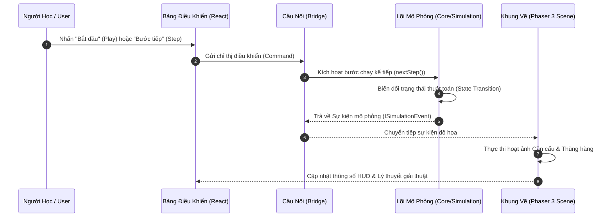

# Luồng Dữ Liệu & Chuỗi Sự Kiện (Data Flows) — Algorithm Game Website

```yaml
DOCUMENT_TYPE: DATA_FLOWS
STATUS: CONFIRMED
LAST_UPDATED: 2026-10-09
```

Tài liệu này mô tả luồng di chuyển dữ liệu chuẩn mực giữa các tầng kiến trúc trong trò chơi Sắp xếp Nhà kho (Warehouse Sorting).

---

## 1. Luồng Điều Khiển & Thực Thi Thuật Toán (Algorithm Execution Flow)



---

## 2. Các Bước Xử Lý Tuần Tự (Processing Steps)

1. **Bước 1: Tiếp nhận tương tác người dùng**: Component React bắt sự kiện click (Play/Step/Pause).
2. **Bước 2: Giao tiếp qua Bridge**: Bridge gọi trực tiếp phương thức của Simulation Engine mà không làm đơ giao diện UI.
3. **Bước 3: Lõi mô phỏng tính toán**:
   - Simulation cập nhật vị trí logic của các thùng hàng trong mảng.
   - Tạo ra sự kiện nguyên tử tương ứng (ví dụ: `COMPARE: ô 2 và ô 3`, hoặc `SWAP: ô 2 và ô 3`).
4. **Bước 4: Trình diễn hoạt ảnh**:
   - Phaser Scene nhận sự kiện, tính toán tọa độ pixel tương ứng của ô 2 và ô 3.
   - Kích hoạt tween di chuyển cần cẩu đến ô 2, hạ tay gắp, nhấc thùng hàng, di chuyển sang ô 3 và hạ xuống.
5. **Bước 5: Hoàn tất & Sẵn sàng bước tiếp theo**:
   - Khi hoạt ảnh Phaser kết thúc, trạng thái sẵn sàng được báo lại để người dùng có thể bấm "Step" tiếp theo.

---

## 3. Các Bất Biến Của Luồng (Flow Invariants)
- **Không vượt rào**: Hoạt ảnh Phaser không bao giờ chạy trước khi sự kiện logic được sinh ra từ Simulation Engine.
- **Tính đồng bộ tuyệt đối**: Tại điểm kết thúc của mỗi bước hoạt ảnh, vị trí hình ảnh của thùng hàng trên màn hình phải trùng khớp 100% với vị trí logic trong mảng dữ liệu.
